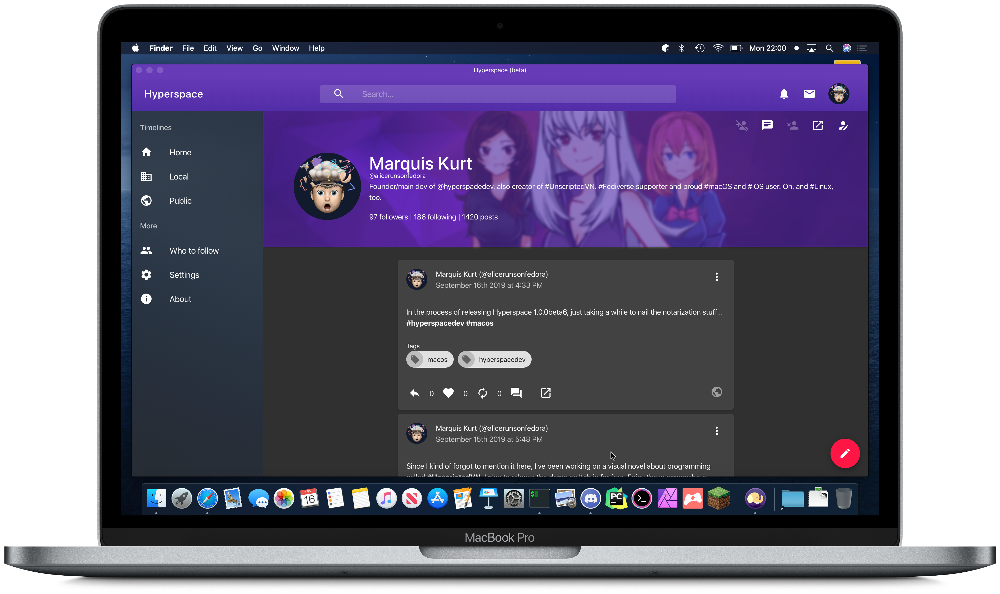

# Download Apps

Ready to give Hyperspace a spin on your computer? Download the desktop apps here.

## macOS

Requires macOS 10.10 (Yosemite) or better and a 64-bit processor

**[Download DMG &rsaquo;](https://github.com/hyperspacedev/hyperspace/releases/download/1.0.0beta6/Hyperspace-1.0.0-beta6.dmg)**

## Windows

Requires Windows 7 or better

**[Download EXE &rsaquo;](https://github.com/hyperspacedev/hyperspace/releases/download/1.0.0beta6/Hyperspace-1.0.0-beta6.exe)**

## Linux

Requires a 64-bit (x86 architecture) processor.

**[Download DEB &rsaquo;](https://github.com/hyperspacedev/hyperspace/releases/download/1.0.0beta6/hyperspace_1.0.0-beta6_amd64.deb)**

**[Download AppImage &rsaquo;](https://github.com/hyperspacedev/hyperspace/releases/download/1.0.0beta6/hyperspace-1.0.0-beta6.AppImage)**