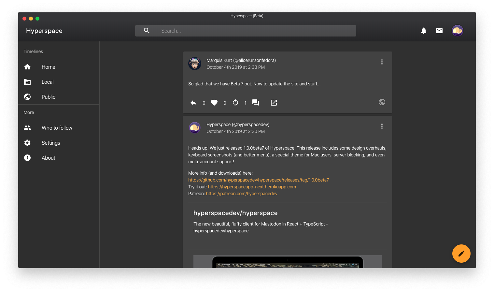

# Home

Hyperspace is the fluffiest client for Mastodon and other fediverse networks written in TypeScript and React. Hyperspace offers a fun, clean, fast, and responsive design that scales beautifully across devices and enhances the fediverse experience.

<a href="https://www.patreon.com/bePatron?u=11893121" data-patreon-widget-type="become-patron-button">Become a Patron!</a>

